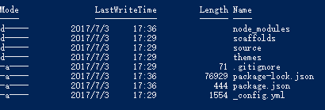
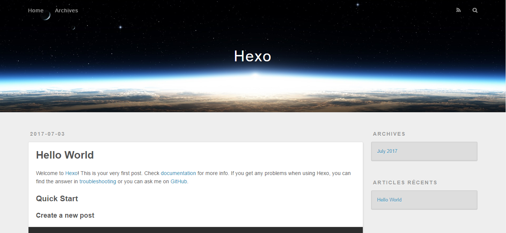

> 博主一直想搭建一个博客，无奈博客园、csdn等博客都太大众化了，出于本人是程序员的身份，所以尝试使用Hexo来搭建博客，本文不会深入解析hexo语法和git语法，需要深入研究的话请自行百度。

<!--more-->

### 前言(-_-好像太正式了)
需要搭建hexo博客必须会使用git、和拥有github账号以及node.js环境。

### 1.安装node.js
由于工作环境问题，暂时提供windows的安装说明。其实也不是什么说明，就一直点下一步。。。
附上[node.js](https://nodejs.org/en/)官网地址,自行click进去download安装吧。

### 2.安装Git
本人的git已经安装多时了，具体安装过程需要注意啥都忘记了，安装过程遇到问题自行百度吧。
附上[git](https://git-scm.com/)官方地址。

### 3.使用node.js的npm包管理工具安装hexo
** step.1 **
``` bash
$ npm install hexo-cli -g
```
由于服务器在外国，可能会出现失败，可以使用淘宝镜像。

** step.2 **
``` bash
$ npm install --save
```

** step.3 **
``` bash
$ hexo init test
```
test是自定义文件名，由于初始化时候需要从github download landscpae默认主题，所以请保持网络畅通

> hexo博客目录结构说明
> 
> 1._config.yml ——是博客主要配置文件,也叫站点配置文件
> 2.db.json——是博客数据库
> 3.node_modules——是NodeJS依赖模块
> 4.source——是博客内容以及其他页面（page）存在的目录，这个目录里面有个_post目录就是我们存放博客内容的地方，也就是存放博客内容markdown文档地方，输入hexo new “newPage”就会在这个目录建立一个名为newPage的子目录，然后在里面放入md文档，并在主题的配置文件里面添加相应栏目newPage，这样就会显示在主页面的目录上。
> 5.themes——是主题存放文件

** step.4 **
进入 test 目录输入以下命令，启动本地博客服务器,默认访问localhost:4000
``` bash
$ hexo s 或 $ hexo server
```
如果看到以下界面，恭喜你，hello world级别的博客搭建成功了
